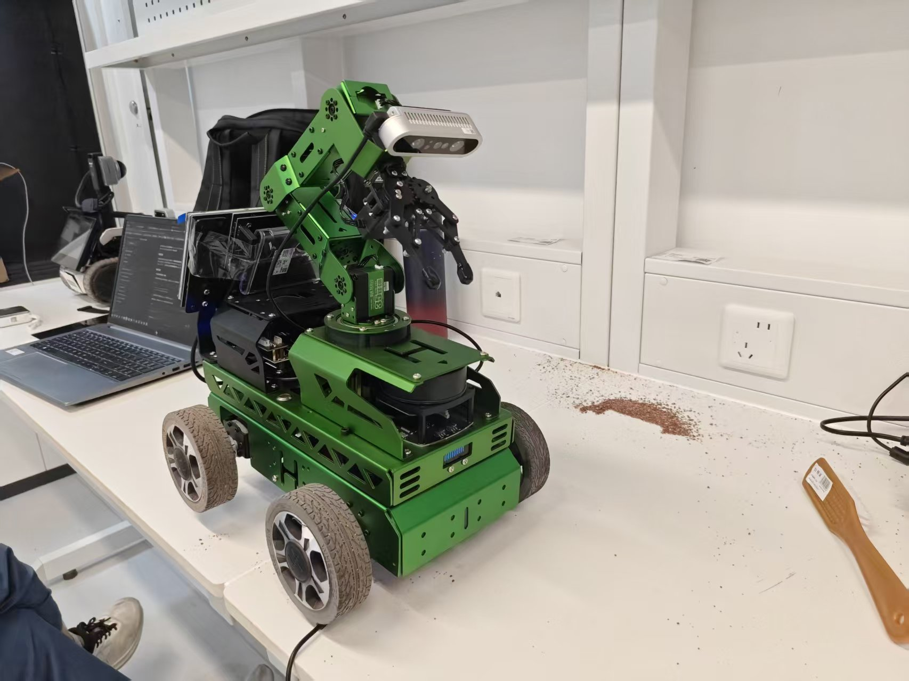
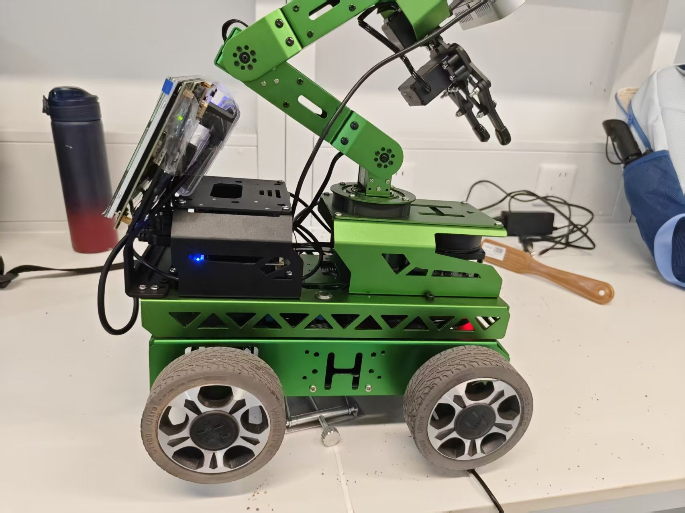

# Hiwonder Jetson Robot

ROS 2 robotics stack for a Hiwonder JetRover-class mobile robot powered by
NVIDIA Jetson Orin NX.

The project integrates robot bringup, RGB-D perception, localization and
navigation, semantic segmentation, synchronized data collection, and
mission-level autonomy on real hardware.

<p align="center">
  
  
  
</p>

> **Status:** active development.
> The current milestone is reliable closed-loop navigation and visual
> return-to-home on the physical robot.

## Overview

This repository is a long-term robotics platform for developing and evaluating
perception and autonomous navigation methods on a Jetson-based mobile robot.

The current system combines:

- ROS 2 Humble robot bringup
- Nav2 localization and navigation
- A1 2D LiDAR
- Dabai RGB-D camera
- IMU and odometry interfaces
- RTAB-Map / RGB-D mapping experiments
- PIDNet-based terrain semantic segmentation
- synchronized sensor and robot-state logging
- staged autonomous mission execution

The project emphasizes **repeatable real-robot evaluation** rather than only
simulation or offline model accuracy.

## Hardware

| Component | Configuration |
| --- | --- |
| Robot | Hiwonder JetRover-class mobile platform |
| Compute | NVIDIA Jetson Orin NX 16 GB |
| OS | Ubuntu 22.04 |
| Middleware | ROS 2 Humble |
| RGB-D camera | Hiwonder Dabai RGB-D |
| LiDAR | Slamtec RPLIDAR A1 |
| IMU | Controller-board IMU |

## System Architecture

```text
Sensors
  ├── Dabai RGB-D camera
  ├── A1 LiDAR  (/scan)
  └── IMU / odometry
        │
        ▼
ROS 2 perception & localization stack
  ├── PIDNet-S semantic perception
  └── Nav2 localization / planning
        │
        ▼
Mission logic
        │
        ▼
Robot controller
```

## Current Capabilities

The current software stack has been validated to support:

- vendor robot bringup on Jetson
- ROS 2 sensor and TF inspection
- single-instance LiDAR, IMU and odometry pipelines
- Nav2 localization and planning infrastructure
- RGB-D acquisition and synchronized logging
- RTAB-Map / RGB-D mapping experiments
- PIDNet-S semantic segmentation training and validation
- structured test protocols for real-robot navigation

The odometry currently used by the vendor stack is partly command-derived and
should not be interpreted as verified wheel-encoder odometry. Real-world
navigation accuracy is therefore evaluated separately.

For the latest engineering status, see
[`docs/CURRENT_STATUS.md`](docs/CURRENT_STATUS.md).

## Current Milestone

### M1 — Closed-loop return-home mission

The current engineering milestone is to complete an approximately 20 m
closed-loop route, return to the starting region, and use a visual marker for
final alignment and approach.

Development follows staged hardware tests:

```text
interface audit
      ↓
0.5 m straight-line test
      ↓
90° turning test
      ↓
1 m × 1 m square
      ↓
5 m × 5 m closed loop
      ↓
visual homing
      ↓
20 m integrated mission
```

The complete test protocol is documented in
[`docs/M1_20M_RETURN_HOME.md`](docs/M1_20M_RETURN_HOME.md).

## Repository Structure

```text
.
├── configs/            Runtime and machine configuration
├── docs/               Architecture, status, roadmap and test records
├── ros2_ws/
│   └── src/            ROS 2 robot and perception packages
├── LICENSE
├── THIRD_PARTY_NOTICES.md
└── README.md
```

The repository includes both project-authored code and imported vendor /
third-party ROS 2 packages. See the licensing section below for details.

## Documentation

- [`docs/PROJECT_CONTEXT.md`](docs/PROJECT_CONTEXT.md) — system assumptions and architecture
- [`docs/CURRENT_STATUS.md`](docs/CURRENT_STATUS.md) — current hardware/software status
- [`docs/ROADMAP.md`](docs/ROADMAP.md) — development milestones
- [`docs/M1_20M_RETURN_HOME.md`](docs/M1_20M_RETURN_HOME.md) — real-robot M1 test protocol

## Roadmap

The project is developed progressively:

**M0 — Observable platform.**
Bringup, interfaces, ROS graph, TF, sensors and diagnostics.

**M1 — Navigation and visual return home.**
Reliable real-world navigation with quantitative evaluation.

**M2 — Demonstration data.**
Synchronized observations and actions for learning.

**M3 — Learned policies.**
Imitation-learning experiments on bounded robot tasks.

**M4 — Policy improvement and deployment.**
Reinforcement learning, distillation and edge deployment.

## Safety

Real-robot actuation is intentionally separated from software inspection and
offline development.

Motion commands and navigation goals should only be executed during supervised
hardware tests with an explicit stop procedure and predefined test limits.

## License

Original code authored for this repository is licensed under the
[MIT License](LICENSE).

Third-party and vendor source code, including Hiwonder ROS 2 packages, remains
subject to its original licensing terms and is not relicensed under this
repository's MIT License.

See [`THIRD_PARTY_NOTICES.md`](THIRD_PARTY_NOTICES.md) for details.
