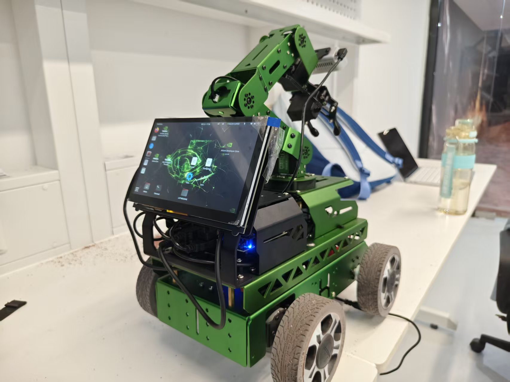

# JetRover ROS 2 Semantic Autonomous Navigation

*ROS 2 · Jetson Orin NX · RGB-D · RTAB-Map · Nav2 · PIDNet-S*

A real-robot autonomous navigation and semantic perception system built on the Hiwonder JetRover platform for experiments in a Mars-analog terrain environment.

This repository contains the robot-side software, ROS 2 integration, semantic perception modules, mission logic, navigation configuration, and project documentation used in our physical robot experiments.

<p align="center">
  
  
  
</p>

<p align="center">
  <b>JetRover platform and Mars-analog field experiments</b>
</p>

## Demo

🎬 [Watch the ~1 minute real-robot demo](media/1.mp4)

The demo shows the physical JetRover running the integrated perception, mapping, navigation, and mission stack in the experimental environment.

## Project Overview

The project started from the stock JetRover ROS 2 platform and was extended into a research-oriented autonomous robot stack.

The final system integrates:

- ROS 2 robot bringup and hardware interfaces
- RGB-D perception
- RTAB-Map based localization / mapping
- Nav2 planning, control, and costmaps
- autonomous exploration and mission execution
- PIDNet-S semantic terrain perception
- semantic hazard information for navigation
- real-robot debugging, logging, and safety handling

The main target environment is a roughly 15 m × 15 m Mars-analog terrain field containing sand, rocks, slopes, craters, steps, and other difficult terrain structures.

## System Architecture

```text
                       ┌─────────────────────┐
RGB-D Camera ─────────>│   RGB / Depth      │
                       └─────────┬───────────┘
                                 │
                    ┌────────────┴────────────┐
                    │                         │
                    ▼                         ▼
            ┌───────────────┐         ┌───────────────┐
            │   PIDNet-S    │         │   RTAB-Map    │
            │   Semantic    │         │ Localization  │
            │ Segmentation  │         │   / Mapping   │
            └───────┬───────┘         └───────┬───────┘
                    │                         │
                    └────────────┬────────────┘
                                 ▼
                       Semantic / Spatial
                         Environment State
                                 │
                                 ▼
                       ┌──────────────────┐
                       │      Nav2        │
                       │ Planner /        │
                       │ Controller /     │
                       │ Costmaps         │
                       └────────┬─────────┘
                                │
                                ▼
                       Mission / Exploration
                                │
                                ▼
                            /cmd_vel
                                │
                                ▼
                            JetRover
```

## What We Built

### 1. ROS 2 Robot Integration

The project uses Ubuntu 22.04 + ROS 2 Humble on an NVIDIA Jetson Orin NX 16 GB.

We integrated and validated the main robot-side interfaces required by the autonomy stack, including:

- chassis motion control
- odometry
- IMU
- TF tree
- RGB-D camera
- ROS 2 launch and runtime management
- logging and experiment utilities

The original Hiwonder packages remain in the workspace where required, while the research-specific logic is implemented as additional packages and configuration.

### 2. Autonomous Navigation

The navigation stack is built around Nav2.

The system uses Nav2 for:

- global path planning
- local motion control
- global and local costmaps
- recovery behavior
- goal execution
- mission-level autonomous movement

For autonomous exploration experiments, exploration logic is integrated on top of the Nav2 stack.

The project was tested on the physical robot rather than only in simulation.

### 3. RGB-D Mapping and Localization

RTAB-Map is used as the main visual / RGB-D mapping and localization component.

For the final Mars-field experiments, the robot primarily maintained a 2D navigation representation while using RGB-D information for environmental perception.

This design kept the navigation stack lightweight enough for real-time onboard operation while still allowing the semantic perception pipeline to reason about terrain appearance and depth.

### 4. PIDNet-S Semantic Terrain Perception

A custom PIDNet-S semantic segmentation pipeline was trained and deployed for Mars-analog terrain understanding.

The perception system was designed to distinguish terrain and hazard-related regions such as:

- normal / other terrain
- hills
- craters
- steps
- robot / obstacle regions
- ignored background areas

The trained model is integrated as an independent ROS 2 semantic perception node and consumes live RGB camera input.

Its output can be combined with robot pose and depth information for navigation-oriented terrain reasoning.

### 5. Real-Robot Mission Autonomy

The repository contains mission-level logic used to connect perception, localization, mapping, and navigation into complete robot experiments.

The robot was tested in tasks involving:

- autonomous movement
- exploration
- mapping
- semantic perception
- terrain-aware navigation experiments
- failure recovery and safety handling

The focus of the project is the complete onboard robotics pipeline, not an isolated perception model.

## Hardware

| Component | Configuration |
| --- | --- |
| Robot | Hiwonder JetRover |
| Main computer | NVIDIA Jetson Orin NX 16 GB |
| Operating system | Ubuntu 22.04 |
| Middleware | ROS 2 Humble |
| Vision | RGB-D camera |
| Motion sensing | IMU + wheel odometry |
| LiDAR | A1 2D LiDAR available on the platform |
| Chassis | Wheeled JetRover platform |

## Software Stack

| Layer | Main Components |
| --- | --- |
| Robot runtime | ROS 2 Humble |
| Navigation | Nav2 |
| Mapping / localization | RTAB-Map |
| Autonomous exploration | exploration logic on top of Nav2 |
| Vision | RGB-D camera, OpenCV |
| Semantic perception | PIDNet-S |
| Deep learning | PyTorch |
| Edge compute | NVIDIA Jetson Orin NX |

## Repository Structure

```text
.
├── configs/                 # Project and machine configuration
├── docs/                    # Architecture notes and experiment documentation
├── ros2_ws/
│   └── src/
│       ├── robot_mission/   # Mission-level robot logic
│       ├── semantic_perception/
│       │                    # PIDNet-S ROS 2 perception integration
│       └── ...              # Hiwonder / third-party ROS 2 packages
├── AGENTS.md
├── LICENSE
├── THIRD_PARTY_NOTICES.md
└── README.md
```

## Experimental Lessons

The physical Mars-analog environment exposed several limitations that are difficult to observe in simple indoor demos.

In particular:

- RGB-D depth becomes unreliable on difficult surfaces and at longer ranges.
- Terrain geometry is harder than ordinary obstacle detection.
- Slopes and crater boundaries are not well represented by a purely 2D navigation model.
- A low-mounted 2D LiDAR can incorrectly interpret terrain as obstacles in rough environments.
- Semantic segmentation quality alone does not guarantee reliable traversability estimation when depth geometry is noisy.

These findings shaped the final system design and are also useful constraints for future work on terrain-aware robotic navigation.

## Project Status

**Main system development completed.**

The repository now serves as a record of the real-robot system, project implementation, and experimental results, and as a base for future research extensions.

## Acknowledgements

This project is built on the Hiwonder JetRover platform and uses open-source components including ROS 2, Nav2, RTAB-Map, OpenCV, PyTorch, and PIDNet.

## License

Original code authored for this repository is licensed under the MIT License. See [LICENSE](LICENSE).

Third-party and vendor source code included in this repository, including Hiwonder ROS 2 packages under `ros2_ws/src/`, remains subject to its original licensing terms and is not relicensed under the MIT License by this repository.

See [THIRD_PARTY_NOTICES.md](THIRD_PARTY_NOTICES.md) for details.
